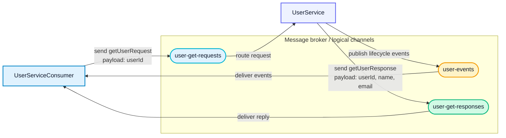

# Example: Bi-Directional Contract Testing with AsyncAPI

## What is this?

This repository demonstrates how to write **Pact consumer tests for a
message-based service** and verify the provider contract using **PactFlow's
AsyncAPI bi-directional contract testing (BDCT)** feature.

The consumer pact and the provider's **AsyncAPI document** are both
published to PactFlow. PactFlow compares them server-side — no provider
code needs to run, and no local comparison tooling is required.

This repo currently holds both the consumer and provider side of the
example in one place. It will eventually be split into standalone
consumer/provider repos, closer in shape to
[`example-bi-directional-provider-postman`](https://github.com/pactflow/example-bi-directional-provider-postman)
and
[`example-bi-directional-provider-drift`](https://github.com/pactflow/example-bi-directional-provider-drift)
(the latter once Drift is used to verify the AsyncAPI provider directly).

### Two messaging patterns are demonstrated

| Pattern | AsyncAPI action | Pact interaction type |
|---|---|---|
| **Fire-and-forget** | `receive` | `Asynchronous/Messages` |
| **Request/Reply** | `send` + `reply` | `Synchronous/Messages` |

---

## Project layout

```
.
├── src/
│   ├── consumer.ts          # User Service event handlers (consumer code)
│   └── consumer.test.ts     # Pact V4 consumer tests
├── provider/
│   └── asyncapi.yaml        # AsyncAPI 3.1.0 document (provider contract)
├── pacts/                   # Generated Pact files (git-ignored)
├── Makefile                 # install / test / publish / can-i-deploy / deploy
├── .github/workflows/       # CI: test → publish → can-i-deploy → deploy
├── package.json
└── vitest.config.ts
```

---

## Quick start

```bash
# Install dependencies
npm install

# Step 1 — run consumer tests → generates ./pacts/*.json
npm run test:consumer

# Step 2 — publish the consumer pact and the provider's AsyncAPI contract
# to PactFlow, then check can-i-deploy
export PACT_BROKER_BASE_URL=https://your-instance.pactflow.io
export PACT_BROKER_TOKEN=your-token
make ci

# OR run individual stages
make test                       # run consumer tests
make publish_pact                # publish the consumer pact
make publish_provider_contract   # publish the provider's AsyncAPI doc
make can_i_deploy                # gate a deployment
```

---

## CI setup

The GitHub Actions workflow (`.github/workflows/build.yml`) needs two
settings configured in this repository (Settings → Secrets and variables →
Actions):

- **Variable** `PACT_BROKER_BASE_URL` — the PactFlow instance URL (e.g.
  `https://your-instance.pactflow.io`)
- **Secret** `PACT_BROKER_TOKEN` — an API token for that instance

Without these, the `test`, `can-i-deploy`, and `deploy` jobs will run
against an empty broker URL and fail.

---

## How it works

### Consumer side

The consumer tests (`src/consumer.test.ts`) use **Pact V4** (`@pact-foundation/pact`)
to describe the messages the consumer expects.  Each interaction is linked to
the relevant **AsyncAPI operation** via the `.reference()` call:

```ts
pact
  .addAsynchronousInteraction()
  .reference('AsyncAPI', 'operationId', 'receiveUserEvents')
  .expectsToReceive('a user-created event', (builder) => {
    builder.withJSONContent({ userId: string('u-abc-123'), email: string('...') });
  })
  .executeTest(v4SynchronousBodyHandler(handleUserCreated));
```

Running the tests writes a Pact file to `./pacts/` with a `comments.references`
block that PactFlow uses to look up the correct AsyncAPI operation:

```json
{
  "comments": {
    "references": {
      "AsyncAPI": {
        "operationId": "receiveUserEvents",
      }
    }
  }
}
```

### Provider side

The provider publishes its **AsyncAPI document**
(`provider/asyncapi.yaml`) to PactFlow as its provider contract. No
provider code runs. PactFlow checks that every interaction in the
published consumer pact is compatible with the schema defined in the
spec, then reports the result via `can-i-deploy`.

```bash
make publish_provider_contract
make can_i_deploy
```

This runs, via `npx @pact-foundation/pact-cli`:

- `pactflow publish-provider-contract provider/asyncapi.yaml --provider
  pactflow-example-bi-directional-provider-asyncapi ...` — uploads the
  spec and lets PactFlow perform the BDCT comparison against previously
  published consumer pacts.
- `pact-broker can-i-deploy --pacticipant
  pactflow-example-bi-directional-provider-asyncapi ...` — checks whether
  the current provider version is safe to deploy to `production`.

---

## AsyncAPI document overview



The `provider/asyncapi.yaml` defines:

- **`userEvents` channel** (`user-events`) — carries `userCreated` and
  `userDeleted` events consumed by downstream services.
- **`getUserRequests` / `getUserResponses` channels** — used for synchronous
  user lookup via request/reply (AsyncAPI 3.x `reply` block).

### Operations

```
receiveUserEvents   action: receive   → fire-and-forget events
getUser             action: send      → request/reply lookup
```