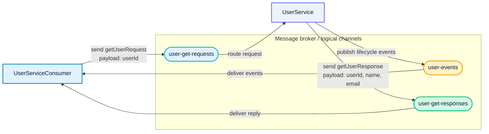

# Example: Bi-Directional Contract Testing with AsyncAPI

## What is this?

This repository demonstrates how to write **Pact consumer tests for a
message-based service** and verify the provider contract using **PactFlow's
AsyncAPI bi-directional contract testing (BDCT)** feature.

The consumer pact and the provider's **AsyncAPI document** are both
published to PactFlow, which compares them server-side.

The provider proves it actually implements its AsyncAPI document using
**[Drift](https://support.smartbear.com/swagger/contract-testing/docs/en/drift/how-to-guides/async-api.html)**.
Drift runs against the real provider over a **Kafka** broker in Docker:
it publishes messages to the provider, collects the replies and side
effects, and checks them against the document. The Drift results are
published to PactFlow with the AsyncAPI document as the provider's
self-verification. This mirrors
[`example-bi-directional-provider-drift`](https://github.com/pactflow/example-bi-directional-provider-drift),
which does the same for HTTP and OpenAPI.

This repo currently holds both the consumer and provider side of the
example in one place. It will eventually be split into standalone
consumer/provider repos.

### Two messaging patterns are demonstrated

| Pattern | AsyncAPI action | Pact interaction type |
|---|---|---|
| **Fire-and-forget** | `receive` | `Asynchronous/Messages` |
| **Request/Reply** | `send` + `reply` | `Synchronous/Messages` |

---

## Project layout

```
.
├── src/
│   ├── consumer.ts             # User Service event handlers (consumer code)
│   ├── consumer.test.ts        # Pact V4 consumer tests
│   └── provider/
│       ├── userService.ts      # User Service business logic (provider code)
│       ├── kafka.ts            # Kafka consumers/producer for the AsyncAPI channels
│       └── server.ts           # Entry point + test-support HTTP API
├── provider/
│   └── asyncapi.yaml           # AsyncAPI 3.1.0 document (provider contract)
├── drift/
│   ├── user-service.drift.yaml # Drift test cases
│   ├── user-service.lua        # Lifecycle hooks that seed provider state
│   └── probes/user-state.ts    # Probe that reports the result of an injected event
├── scripts/wait-for-health.ts  # Waits for the provider to be ready
├── compose.yaml                # Local Kafka broker
├── pacts/                      # Generated Pact files (git-ignored)
├── output/                     # Drift results and provider log (git-ignored)
├── Makefile                    # install / test / verify / publish / can-i-deploy / deploy
├── .github/workflows/          # CI: test → verify → publish → can-i-deploy → deploy
├── package.json
└── vitest.config.ts
```

---

## Quick start

Prerequisites: Node.js 24+, Docker, and a PactFlow workspace with Drift enabled.

```bash
# Install dependencies (includes the Drift CLI, @pactflow/drift)
npm install

# Log Drift in to your PactFlow workspace (one-off)
npx drift auth login https://your-instance.pactflow.io

# Consumer — run the Pact tests → generates ./pacts/*.json
make test

# Provider — start Kafka, then verify the provider with Drift
make kafka_up
make test_provider
make kafka_down

# Everything, as CI does it: test, verify, publish both contracts to
# PactFlow, then check can-i-deploy. Credentials come from the environment
# or from a git-ignored .env file (cp .env.example .env)
export PACT_BROKER_BASE_URL=https://your-instance.pactflow.io
export PACT_BROKER_TOKEN=your-token
make fake_ci
```

Individual stages:

```bash
make test                        # run consumer tests
make publish_pact                # publish the consumer pact
make kafka_up / make kafka_down  # start / stop the local Kafka broker
make test_provider               # start the provider and run Drift against it
make publish_provider_contract   # publish the AsyncAPI doc + Drift results (needs EXIT_CODE)
make can_i_deploy                # gate a deployment
```

To work on the provider interactively, run it yourself and point Drift at it:

```bash
make kafka_up
npm run start:provider                                 # terminal 1
npx drift verify -f drift/user-service.drift.yaml      # terminal 2
```

---

## CI setup

The GitHub Actions workflow (`.github/workflows/build.yml`) needs two
settings configured in this repository (Settings → Secrets and variables →
Actions):

- **Variable** `PACT_BROKER_BASE_URL` — the PactFlow instance URL (e.g.
  `https://your-instance.pactflow.io`)
- **Secret** `PACT_BROKER_TOKEN` — an API token for that instance

Without these, the `test`, `can-i-deploy`, and `deploy` jobs will run
against an empty broker URL and fail. The same credentials log in to Drift
(`npx drift auth login`), so the workspace must have Drift enabled.

The `test` job starts Kafka with Docker Compose on the runner. It uploads
the `output/` directory (Drift results and provider log) as a
build artifact.

---

## How it works

### Consumer side

The consumer tests (`src/consumer.test.ts`) use **Pact V4** (`@pact-foundation/pact`)
to describe the messages the consumer expects.  Each interaction is linked to
the relevant **AsyncAPI operation** via the `.reference()` call:

```ts
pact
  .addAsynchronousInteraction()
  .reference('AsyncAPI', 'operationId', 'receiveUserEvents')
  .expectsToReceive('a user-created event', (builder) => {
    builder.withJSONContent({ userId: string('u-abc-123'), email: string('...') });
  })
  .executeTest(v4SynchronousBodyHandler(handleUserCreated));
```

Running the tests writes a Pact file to `./pacts/` with a `comments.references`
block that PactFlow uses to look up the correct AsyncAPI operation:

```json
{
  "comments": {
    "references": {
      "AsyncAPI": {
        "operationId": "receiveUserEvents",
      }
    }
  }
}
```

### Provider side

The provider (`src/provider/`) is a small Node.js service. It consumes
`user-events` and `user-get-requests` from Kafka and replies on
`user-get-responses`.

#### 1. Verify the provider against its AsyncAPI document with Drift

`make test_provider` starts the provider, waits for its Kafka consumers to
join their groups, and runs `drift verify` with
`drift/user-service.drift.yaml`. Drift chooses how to test each operation
from its AsyncAPI `action`:

| Operation | Drift mode | What Drift does |
|---|---|---|
| `receiveUserEvents` (`receive`) | `async-inject` | Publishes a `userCreated` / `userDeleted` event to `user-events`, then runs `drift/probes/user-state.ts`. The probe asks the provider for the resulting user state and returns it as JSON. Drift compares that JSON with the test's `expected` block. |
| `getUser` (`send` + `reply`) | `async-request-reply` | Subscribes to `user-get-responses`, publishes a `getUserRequest` with a `correlation-id` header, and captures the reply carrying the same id |

Drift also validates every message it publishes or captures against the
schemas in the AsyncAPI document. The `operation:started` hook in
`drift/user-service.lua` resets the provider before each operation. It also
seeds any users the operation needs, through a test-only HTTP API on port
8081.

Three additions to `provider/asyncapi.yaml` make it runnable by Drift without
changing any message schemas:

- `defaultContentType: application/json`, so Drift knows how to encode the
  payloads it publishes
- a `servers.local` entry for the Kafka broker, which Drift uses as its
  default connection
- a `correlationId` (`$message.header#/correlation-id`) on the request/reply
  messages, which tells Drift how to match a reply to its request

#### 2. Publish the AsyncAPI document and the Drift results

```bash
make publish_provider_contract EXIT_CODE=0
make can_i_deploy
```

This runs, via `@pact-foundation/pact-cli`:

- `pactflow publish-provider-contract provider/asyncapi.yaml --provider
  pactflow-example-bi-directional-provider-asyncapi --verifier drift
  --verification-results output/.../verification.*.result ...`. This
  uploads the spec with Drift's results as the provider's
  self-verification, and lets PactFlow compare it with previously
  published consumer pacts. `make test_and_publish` publishes whether Drift
  passed or failed, and passes Drift's exit code in `EXIT_CODE`.
- `pact-broker can-i-deploy --pacticipant
  pactflow-example-bi-directional-provider-asyncapi ...` — checks whether
  the current provider version is safe to deploy to `production`.

---

## AsyncAPI document overview


```mermaid
flowchart LR
  consumer["UserServiceConsumer"]
  provider["UserService"]

  subgraph broker["Message broker / logical channels"]
    direction TB
    events(["user-events"])
    requests(["user-get-requests"])
    responses(["user-get-responses"])
  end

  provider -- "publish lifecycle events" --> events
  events -- "deliver events" --> consumer

  consumer -- "send getUserRequest<br/>payload: userId" --> requests
  requests -- "route request" --> provider

  provider -- "send getUserResponse<br/>payload: userId, name, email" --> responses
  responses -- "deliver reply" --> consumer

  classDef app fill:#e0f2fe,stroke:#0284c7,stroke-width:2px,color:#0f172a;
  classDef service fill:#eef2ff,stroke:#6366f1,stroke-width:2px,color:#0f172a;
  classDef eventStream fill:#fef3c7,stroke:#f59e0b,stroke-width:2px,color:#0f172a;
  classDef request fill:#e0f2fe,stroke:#06b6d4,stroke-width:2px,color:#0f172a;
  classDef response fill:#d1fae5,stroke:#10b981,stroke-width:2px,color:#0f172a;

  class consumer app;
  class provider service;
  class events eventStream;
  class requests request;
  class responses response;
```

The `provider/asyncapi.yaml` defines:

- **`userEvents` channel** (`user-events`) — carries `userCreated` and
  `userDeleted` events consumed by downstream services.
- **`getUserRequests` / `getUserResponses` channels** — used for synchronous
  user lookup via request/reply (AsyncAPI 3.x `reply` block).

### Operations

```
receiveUserEvents   action: receive   → fire-and-forget events
getUser             action: send      → request/reply lookup
```